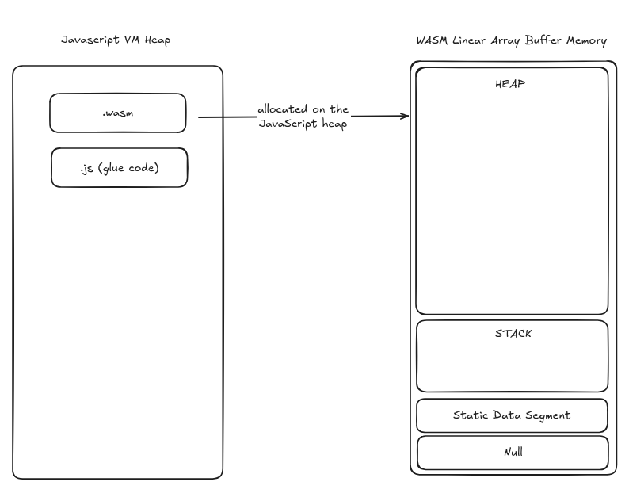
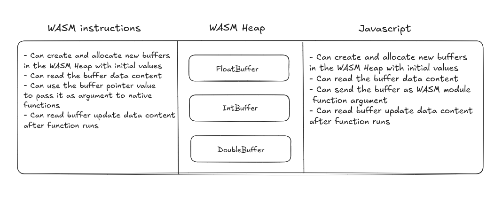

# Technical Lab: C++ to WebAssembly Bindings with Emscripten

Welcome! If you are reading this, you are likely tasked with taking a high-performance C++ library or application and exposing it to the browser using **WebAssembly (WASM)** and **Emscripten**.

This guide is structured as a very short comprehensive mentorship workshop. We will walk through how memory works, why simple bindings often fall short, and how to design robust, zero-copy, user-friendly WASM APIs.

This documentation accompanies the Car Wash API demonstration, providing a simple and concise, reusable blueprint/mental model for mapping complex C++ architectures to Javascript via WebAssembly using Embind.

---

## Core Concepts: WebAssembly & Emscripten

### What is Emscripten?
Emscripten is a complete compiler toolchain (using LLVM) that compiles C/C++ code into `.wasm` binaries and generates the necessary Javascript boilerplate (`.js`) to load and interact with the module.

**Embind:** Emscripten's binding framework that lets you bind C++ functions, classes, and values directly into Javascript objects.

> [!TIP]
> _Emscripten is well-documented. We recommend reading the sections covering the
> [Emscripten Compiler Settings](https://emscripten.org/docs/tools_reference/settings_reference.html),
> the [Emscripten SDK](https://emscripten.org/docs/tools_reference/emsdk.html),
> and the [Embind](https://emscripten.org/docs/porting/connecting_cpp_and_javascript/embind.html)
> library. To understand the limitations and caveats related to using the
> browser as a platform, see the
> [Porting](https://emscripten.org/docs/porting/index.html#porting) section._

### What is WebAssembly (WASM)?
WebAssembly is a low-level binary format that runs at near-native speed in modern web browsers. It allows code written in languages like C, C++, and Rust to run securely alongside Javascript.

**Linear Memory:** Unlike Javascript (which uses a garbage-collected heap of objects), WASM operates on a single contiguous block of memory (an `ArrayBuffer`). C++ pointers are simply integer indices pointing into this single buffer.

The following image ilustrates an overview of a WASM module that is loaded in the browser and how its memory layout structured:
<p align="center">
  
</p>

#### Memory layout:
- Null segment: Usually a small reserved area at the very bottom (address 0) to catch null pointer dereferences, helping the program crash safely rather than corrupting data. A small offset at the start (usually to catch null pointer dereferences).
- Static segment: Stores global variables and constants. Its size is determined at compile-time. This is where "baked-in" data lives—things like global constants or string literals that were defined when the code was compiled.
- Stack: Used for local variables and function calls. This grows and shrinks as functions are called. It stores local variables and return addresses.
- Heap: Is the dynamic portion of the linear memory buffer dedicated to storing data that is created or resized while the program is actually running. Unlike the stack, which handles temporary local variables, the heap is used for long-lived data or structures.

#### WASM Boundaries:
Security is the "prime directive" of the WASM design. There are strict boundaries in place:
- The WASM module is trapped. It cannot see the hard drive, it cannot see the DOM, and it cannot see other Javascript variables unless they are explicitly "passed" into the module.
- WASM can only see its own Linear Memory (the right box). It has no idea that the "Javascript VM Heap" (the left box) even exists.
- The actual code/instructions reside in a separate, internal memory area managed by the Browser's VM. This area is **read-only** and non-executable by the user. Because the code is stored separately, a classic "buffer overflow" attack—where a hacker writes malicious code into the data segment and tries to execute it—is physically impossible in WASM.

#### How the module is loaded
Loading a WASM module is a multi-step handshake between the browser’s network layer and the Javascript engine
1. Fetching: Javascript uses the `fetch()` API to grab the `.wasm` binary file from the app server.
2. Compilation & Instantiation: The modern approach uses `WebAssembly.instantiateStreaming()`. This is highly efficient because the browser starts compiling the binary to machine code while the file is still downloading.
3. The "Glue Code": The `.js` "glue code" acts as the translator. Since WASM can only natively handle numbers (integers and floats), the JS glue code handles complex tasks like type marshalling, DOM manipulation, memory management, among other tasks.

## The "Anti-Pattern": Raw C-Style Bindings

Before diving into the design decisions that optimize WASM bindings, let’s examine the baseline: exposing a raw C++ function. To provide context for our final architecture, we will first demonstrate a manual, C-style memory management approach. In this scenario, Javascript interacts directly with the WASM linear memory, highlighting the complexities we aimed to solve. You'll also have a glimpse of how we address the situation.


### Manual Memory Management (C-Style)

Imagine binding this C-function directly:
```cpp
#include <iostream>
#include <emscripten.h>

extern "C" {
    // This raw C function expects direct memory pointers
    EMSCRIPTEN_KEEPALIVE
    void processData(const char* str1, const char* str2, float* floats, int array_size) {
        std::cout << "String 1: " << str1 << std::endl;
        std::cout << "String 2: " << str2 << std::endl;
        std::cout << "Floats: ";
        for (int i = 0; i < array_size; i++) {
            std::cout << floats[i] << (i == array_size - 1 ? "" : ", ");
        }
        std::cout << std::endl;
    }
}
```

To call this from Javascript, a developer must manage the heap manually, which makes the code incredibly verbose and prone to memory leaks:

```javascript
// 1. Allocate memory for the array
const floatData = new Float32Array([10.5, 20.5, 30.5]);
const bytesPerElement = 4;
const arrayPtr = Module._malloc(floatData.length * bytesPerElement);

// Copy data to the WASM heap
Module.HEAPF32.set(floatData, arrayPtr >> 2);

// 2. Use ccall for the function execution
// ccall(ident, returnType, argTypes, args)
Module.ccall(
    'processData',       // C function name
    null,                // Return type (void)
    ['string', 'string', 'number', 'number'], // Argument types
    ['Hello', 'World', arrayPtr, floatData.length] // Actual arguments
);

// 3. Manually free ONLY the array
// (ccall already handled freeing the 'Hello' and 'World' strings)
Module._free(arrayPtr);
```

#### The problem
Whether you're a JS veteran or a beginner, we can agree: this is a mountain of code for a single function call. Scaling this to handle complex data structures is a recipe for technical debt.

By forcing developers to manage WASM memory manually, we’re introducing low-level risks into a high-level environment. Mismanaging offsets or leaking memory isn't just a bug; it’s a security and stability risk. We should be striving for type-safety and idiomatic patterns, not manual pointer arithmetic. Next, we’ll demonstrate how to abstract this complexity away into a much cleaner implementation.

### An idiomatic Javascript API for C++ applications

To avoid making JS developers manage raw C-pointers (which, to be honest, we are not used to), we used a _Wrapper_. This abstracts the "ugliness" of memory pointers into a clean API.

```cpp
#include <emscripten/bind.h>
#include <emscripten/val.h>
#include <string>
#include <vector>

// The function Wrapper
void processDataWrapper(std::string s1, std::string s2, val floatArray) {
    // 1. Convert JS TypedArray to a temporary C++ vector
    std::vector<float> vec = vecFromJSArray<float>(floatArray);
    // 2. Call the original raw function using the internal buffers
    processData(s1.c_str(), s2.c_str(), vec.data(), vec.size());
}

EMSCRIPTEN_BINDINGS(my_module) {
    function("processData", &processDataWrapper);
}

```
The Javascript Call: Now, the API is transparent and behaves like a native Javascript library:

```javascript
// Clean API: No malloc, no, ccall, no pointers, no manual encoding
Module.processData("Hello", "World", new Float32Array([1.1, 2.2, 3.3]));
```

#### Why this works?
The "Function Wrapper" approach works because it shifts the responsibility of memory management from the Javascript user to the Emscripten Embind framework. By using a wrapper, we create a "bridge" where data is automatically translated between the two environments.

- Automatic Type Marshalling: Embind recognizes standard C++ types like `std::string`. When we call the function from Javascript, Embind automatically handles the allocation of memory, the UTF-8 encoding of the string, and—crucially—the deallocation once the C++ function scope ends.
- The `val` Class: By using `emscripten::val`, we are essentially holding a reference to a native Javascript object (like a `Float32Array`) directly within C++. This allows us to use helper utilities (like `vecFromJSArray`) to copy data into a C++ `std::vector` in a single, optimized step. The bad thing about `emscripten::val` is that it is mapped to TypeScript’s `any` type by default, which does not provide much useful information for API’s that consume or produce `val` types. To give better type information, custom val types can be registered using `EMSCRIPTEN_DECLARE_VAL_TYPE()` in combination with [emscripten::register_type](https://emscripten.org/docs/porting/connecting_cpp_and_javascript/embind.html#custom-val-definitions).
- Managed Lifecycles: In the manual approach, if our Javascript code crashed before calling `_free()`, we leaked memory. In the wrapper approach, the `std::vector` and `std::string` are local variables on the C++ stack. They are automatically destroyed when the function returns, ensuring no memory leaks occur regardless of what happens on the Javascript side.
- Type Safety and Validation: Because the API is defined in `EMSCRIPTEN_BINDINGS`, the bridge can perform runtime checks. If a developer tries to pass a `Boolean` where a `String` is expected, the system can throw a meaningful Javascript error rather than silently corrupting the WASM heap.

**The Result**: A "Black Box" Experience. For the community and other developers, our C++ logic now feels like a native Javascript module. They don't need to know about linear memory, pointers, or byte alignments; they simply pass standard Javascript objects, call functions and get results.

---

## Subfolder Directory Breakdown

```
embind-lab/
├── app/                 # Web frontend containing JS/TS consumer scripts
│   ├── index.html
│   └── main.ts
├── bindings.cc          # The proxy Embind wrapper bridging native C++ to the Web
├── cpp_app/             # Contains the underlying C++ structures, enums, and function logic representing the native API.
│   ├── car_wash.h
│   └── car_wash.cc
└── CMakeLists.txt       # Cross-compilation instructions
```

---

## Design Decision 1: Wrapped Classes

### The challenge
In many C/C++ applications, data is organized in large structs. When exposing these to Javascript via Embind, the naive approach is to use [value_object](https://emscripten.org/docs/api_reference/bind.h.html#_CPPv412value_object) to map the struct fields directly to a JS object, which sounds very convenient and easy to do, but has a high cost. Another option is to use raw pointer exposure, but returning raw `intptr_t` / memory addresses directly to JS makes the API untyped and unergonomic.

The issue is that `value_object` triggers a full serialization and deserialization cycle (copying all fields) every single time the object crosses the boundary between JS and C++. For large structs or high-frequency calls, this overhead renders the application useless performance-wise.

Furthermore, Embind struggles with type conversion for raw pointers to structs when these are used as arguments in functions, which is common in C APIs.

### The solution
Instead of binding a struct directly with `value_object`, we first build a **wrapper class** in C++. This class holds a pointer to the underlying C struct and exposes getters, setters, and necessary methods to Javascript.

In [bindings.cc](./bindings.cc), we define the `Car` class that wraps the `myCar` struct:

```cpp
class Car {
 public:
  Car(const std::string& plate, float dirt_level) : car_(new myCar()) { ... }
  ~Car() { delete car_; }

  int GetId() const { return car_->id; }
  void SetId(int id) { car_->id = id; }
  // ...
 private:
  myCar* car_;
};
```

We then bind this `Car` class using Embind's [class_](https://emscripten.org/docs/api_reference/bind.h.html#_CPPv46class_) binder. What we end up binding is not the struct, but its wrapper class instead:
```cpp
emscripten::class_<Car>("Car")
// ...
```

If you are wondering why we don't bind the original struct `myCar` with `class_` directly, here are the technical reasons:
1. The compilation wall: Emscripten literally cannot bind raw pointers (`double*`, `int*`) to JS properties from a struct. Without a wrapper to define the translation, or a getter function exposing those fields as `typed_memory_view`, the build will fail.
2. Addresses are useless: Even if it did compile, JS would only see a raw memory address (an integer). You can't index a number (e.g., `address[5]`), which makes the data inaccessible without manual memory math on the JS side.
3. Memory volatility: WASM memory can "grow" and move. If it does, any direct pointer held by JS can become "stale" or detached, causing the application to crash.
4. No bounds safety: pointers don't know their own length. A wrapper can link the pointer to its size, preventing JS from reading wrong memory.
5. Manual cleanup: Native structs don't talk to the JS Garbage Collector. Without a wrapper to manage the lifecycle, you are guaranteed to either leak memory or trigger a segfault.

### The impact
1. Control: allows us to manage the memory lifecycle (explicitly handling `new` and `delete`), while safely exposing typed getters and setters.
2. Performance: It entirely avoids unnecessary copying while guaranteeing that Javascript users interact with stable, persistent handles in the WebAssembly linear memory heap. When JS reads `car.dirtLevel`, only that specific field is accessed via the getter function. No full struct copy occurs.
3. Pointer Handling: The wrapper class manages the lifecycle of the underlying pointer (`myCar*`), making it safe to pass around on the JS side as an opaque handle.

---

## Design Decision 2: The WasmBuffer

### The challenge
Sometimes we need to pass large arrays of data back and forth between WASM and JS, or handle functions that fill provided buffers of memory (like `compute_required_resources`). Copying these arrays between the WASM heap and the JS heap on every call can destroy the app's performance.

### The solution
We introduce the **WasmBuffer** concept. It is a C++ class that allocates memory on the WASM heap and provides a way to create a `TypedArray` view pointing directly to that memory in JS.

See the `class WasmBuffer` in [bindings.cc](bindings.cc). The buffer can be created empty, with a given size or even with an actual array of values:

Note how you can bind the buffer for any type you need
```cpp
emscripten::class_<WasmBuffer<int>>("IntBuffer")
// ...
emscripten::class_<WasmBuffer<float>>("FloatBuffer")
// ...
```

When you create a WasmBuffer (like a `FloatBuffer`), the C++ code allocates a block of space within the WASM Linear Memory.
Instead of copying those numbers into a Javascript array, the WasmBuffer provides a `TypedArray` View (e.g., `Float32Array`). This view acts as a "window" that looks directly into the WASM heap. Rather than thinking of Javascript and WebAssembly as two separate rooms that must mail boxes of data back and forth, this window treats them as two people looking at the exact same physical piece of paper.

> [!NOTE]
> By default, Embind copies `std::vector` when crossing the boundary. `WasmBuffer` uses `emscripten::typed_memory_view` to explicitly tell Embind NOT to copy, but to provide a reference instead.

This image ilustrates both JS and WASM code action spectrum with the buffer approach:
<p align="center">
  
</p>

In [main.ts](app/src/main.ts), usage looks like this:
```typescript
const errorsBuffer = new Module.IntBuffer(5); // Count constructor
Module.runDiagnostics(car, errorsBuffer); // Fills the buffer in WASM

const view = errorsBuffer.getView(); // JS gets a direct view
console.log(view[0]); // Read directly from WASM heap
```

### The Impact
1. 100% Zero-Copy: The `typed_memory_view` allows Javascript to read and write directly to the region of the WASM heap where the C++ std::vector's data is stored.
2. Real-Time Sync: Any modifications made by WASM are instantly visible to JS without any function call overhead, and vice-versa.
3. Shared window: Both WASM and JS can read and write the same block of memory at any-time, allowing to perform mechanisms such as out parameters.

## Design Decision 3: Wrapper Functions

### The challenge
Structs aren't the only challenge when crossing the WASM/JS boundary. Function signatures, especially those involving pointers as arguments or return types, often require extra work when binding. C APIs commonly use pointers in several scenarios:

- Passing large objects by reference (`myCar*`).
- Out parameters: "Returning" data through a function argument.
- Passing fixed/dynamic sized array types that Embind doesn't know how to convert automatically (like fixed-size C strings `char[10]` or numbers `float[4]`).

Embind does not support raw pointers like `int*` or `float*` as function arguments out-of-the-box. This is because Embind lacks the necessary context to manage the memory lifecycle of these pointers (e.g., ownership, lifetime) when crossing the WASM/JS boundary. Consequently, Embind's [built-in type conversions](https://emscripten.org/docs/porting/connecting_cpp_and_javascript/embind.html#built-in-type-conversions) often fall short. Furthermore, exposing raw pointers directly to Javascript results in an unergonomic API for JS developers, as they would need to manually manage memory addresses, which is error-prone and complex. To create a seamless and idiomatic API for JS developers, understanding how to best expose the original C++ API is crucial.

### The solution
To address these challenges, we create **wrapper functions** in C++. These wrappers provide a more idiomatic and JS-friendly signature, abstracting away the complexities of raw pointers and managing their lifecycle gracefully. This approach is key to handling various scenarios, as detailed below.

#### Scenario 1: Handling struct type conversions
Observe how in [car_wash.h](cpp_app/car_wash.h), the C `wash_car` function expects a raw pointer to a struct:
```cpp
void wash_car(myCar* car);
```

Because Javascript does not natively handle C++ struct pointers in function arguments, and Embind cannot automatically cast a Javascript object back to a raw `myCar*` pointer, our C++ wrapper classes come into play to bridge this gap.

In [bindings.cc](bindings.cc), we resolve this by defining a wrapper function that accepts a reference to our C++ wrapper class `Car&`. We then get the underlying raw pointer from that wrapper to execute the native function call.
```cpp
void WashCarWrapper(Car& car) {
  wash_car(car.get()); // car.get() provides the raw myCar*
}
```
Note that what we end up binding is not the function, but its wrapper instead:
```cpp
emscripten::function("washCar", &WashCarWrapper);
```

#### Scenario 2: Handling other unsupported types
Embind doesn't automatically convert `char plate[10]` (`char*`) to a JS string and vice versa. We use getters and setters in the `Car` wrapper class:
```cpp
std::string GetPlate() const { return car_->plate; }
void SetPlate(const std::string& plate) {
  std::strncpy(car_->plate, plate.c_str(), 9);
  car_->plate[9] = '\0';
}
```
Similarly, a standalone function that needs to operate with a `char*` argument or return type would have a corresponding wrapper function that handles it using a `std::string`.
Wrapper functions also solve the same problem but when using other pointer types like `float*` or `int*`, the next scenario indirectly elaborates on that.

#### Scenario 3: Handling Out Parameters
Functions that "return" data via pointer arguments (out parameters) are a common pattern in C/C++ APIs. For example, `compute_required_resources` updates `resources_out` argument which should be readable by the caller once the function ends if we want to keep original API behavior. Note that this function returns nothing (its return type is `void`).
```cpp
void compute_required_resources(myCar* car, float* resources_out);
```
While developers *are* allowed to create wrapper functions that break how the underlying API is exposed (for example, by changing the return type from `void` to return the values directly), in many cases a requirement or philosophy is to **preserve the nature of the original signature** to keep the mental model of the API intact.

To achieve this while still supporting out parameters, we use `WasmBuffer` in the wrapper function as the argument type. This allows us to preserve the out parameter mechanism effectively.

In [bindings.cc](bindings.cc), we solve this by wrapping the function and allowing JS code to pass a `WasmBuffer` of the type of the out parameter. We then use the buffer's pointer when calling the native/original function inside the wrapper:
```cpp
void ComputeRequiredResourcesWrapper(Car& car, WasmBuffer<float>& resources_out) {
  compute_required_resources(car.get(), resources_out.GetPointer());
}
```

What we end up binding is not the function, but its wrapper instead:
```cpp
emscripten::function("computeRequiredResources", &ComputeRequiredResourcesWrapper);
```

### The Impact
1. By using `WasmBuffer` as a layer, the wrapper function maintains the out parameter mechanism of the C API. The JS developer passes a buffer object that is filled by the WASM code, and can then read the results directly via `buffer.getView()` with zero-copy overhead, yielding a Javascript typed array (e.g., `[75.0, 10.0, 25.0]`).
2. Note that in the example wrapper function, the argument `resources_out` is of type `WasmBuffer<float>`, replacing the native `float*`. As mentioned in the last part of Scenario 2, `WasmBuffer` also solves the problem of handling any function parameter of type pointer like `int*`, `float*`, `double*`, etc.

---

## Execution Instructions

Standard Emscripten CMake compilation pipeline:
```sh
mkdir build
emcmake cmake -B build
cmake --build build
```
This command will generate the following folders under the project root:

- `build`: contains MuJoCo compiled using Emscripten.
- `dist`: contains the WebAssembly module, `.js` and `.d.ts` files.

To run the car wash web app first make sure to install npm dependencies
```sh
npm i --prefix=./app
```
and then run
```sh
npm run dev --prefix=./app
```

---

## Summary and Further Resources

This lab demonstrated three key design decisions for creating efficient and idiomatic WebAssembly bindings using Emscripten and Embind:

1.  **Wrapped Classes:** Encapsulating C structs in C++ classes to avoid costly serialization/deserialization and safely manage pointers across the WASM/JS boundary.
2.  **WasmBuffer:** Implementing a zero-copy buffer mechanism to efficiently pass large arrays between WASM and JS by providing `TypedArray` views directly into the WASM heap.
3.  **Wrapper Functions:** Crafting C++ wrapper functions to handle complex scenarios like struct pointers, unsupported types (`char*`, `float*`), and out-parameters, resulting in a more ergonomic Javascript API.

For more in-depth information on Embind and its capabilities, please refer to the official Emscripten documentation on [embind](https://emscripten.org/docs/porting/connecting_cpp_and_javascript/embind.html#embind).
